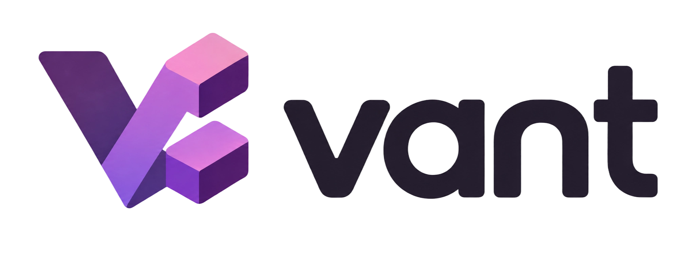

<div align="center">



# v-cli

**kevlns 的个人工具箱 CLI：插件化架构，内置命令随版本发布，本地插件放目录即生效。**

[](https://www.npmjs.com/package/@kevlns/v-cli)
[](https://www.npmjs.com/package/@kevlns/v-cli)
[](https://github.com/kevlns/v-cli/actions/workflows/test.yml)
[](./LICENSE)

[Getting started](#getting-started) · [API](#api) · [Examples](#examples) · [Package family](#package-family)

</div>

---

## Why v-cli?

v-cli 让你**用一个命令沉淀所有个人小工具**，而不用为每个工具建仓库、发包、记命令。
它被设计为**零依赖安装、秒级启动、写个文件就能扩展**，与 kevlns 工具家族的其余部分可自由组合。

- **插件化架构** - 内置命令走注册表随版本发布；本地插件放进 `~/.v-cli/commands/` 立即生效，无需发版
- **容错加载** - 单个插件语法错误或形状不符只会被跳过并报告，绝不阻断其他命令
- **双通道输出** - 结果走 stdout（可管道、可脚本化），诊断走 stderr；全局 `--json` 任意位置生效
- **TypeScript-first** - 严格类型编写，tsup 打包为单文件 ESM，安装后无依赖树、启动快

## Getting started

### Install

```bash
npm install -g git+https://github.com/kevlns/v-cli.git
```

<details>
<summary>发布 npm 后</summary>

```bash
npm install -g @kevlns/v-cli
```

</details>

### Quick start

```bash
v-cli doctor          # 环境体检：node/版本、主目录、配置、插件状态
v-cli plugin list     # 列出内置命令与本地插件
v-cli ts 1710000000   # 时间戳互转
```

> [!TIP]
> 所有命令都支持 `--json`（任意位置）：`v-cli doctor --json` 输出机器可读结果，方便脚本消费。

## Examples

### 写一个本地插件

```js
// ~/.v-cli/commands/hello.mjs
export default {
  name: "hello",
  description: "示例插件",
  register(program, ctx) {
    program.action(() => ctx.log.result("hello world"));
  },
};
```

保存后立即生效：

```bash
v-cli hello           # hello world
v-cli plugin list     # [local] hello 已出现
```

### 在脚本中消费输出

```bash
v-cli ts 1710000000 --json | jq .seconds
```

## API

### 内置命令

| 命令 | 说明 |
| --- | --- |
| `v-cli doctor` | 环境体检：node/v-cli 版本、主目录、config 可写性、本地插件与加载错误 |
| `v-cli plugin list` | 列出全部命令（标注 builtin/local 来源） |
| `v-cli plugin path` | 打印本地插件目录 |
| `v-cli ts [value]` | 无参=当前时间；数字（秒/毫秒自动识别）=转可读时间；日期串=转时间戳 |

### 插件契约 `CliCommand`

```ts
interface CliCommand {
  name: string;                                    // 子命令名
  description: string;
  hidden?: boolean;
  register(program: Command, ctx: CliContext): void;
}

interface CliContext {
  log: Logger;        // result() 走 stdout，info/warn/error 走 stderr
  config: ConfigStore; // <home>/config.json 惰性读写
  json: boolean;      // 全局 --json 开关，命令必须尊重
  homeDir: string;    // 主目录（默认 ~/.v-cli）
}
```

#### 环境变量

| 变量 | 默认值 | 说明 |
| --- | --- | --- |
| `V_CLI_HOME` | `~/.v-cli` | 覆盖主目录（配置、本地插件都从这里找） |

## Package family

kevlns 工具家族共享同一套发布约定（tag 驱动、CI 护栏、MIT）。

| Package | Purpose | Status |
| --- | --- | --- |
| [`v-cli`](https://github.com/kevlns/v-cli) | 个人工具箱 CLI（本仓库） | v0.1.0 |
| [`xlmerge`](https://github.com/kevlns/xlmerge) | Git 中 .xlsx/.xlsm 冲突可视化解决工具 | v1.2.0 |

## Compatibility

| Runtime | Supported versions |
| --- | --- |
| Node.js | `18` and later |
| TypeScript | `5.6` and later（仅开发时） |

CLI 以单文件 ESM（`dist/cli.mjs`）分发，安装后零运行时依赖。

## Contributing

```bash
git clone https://github.com/kevlns/v-cli.git
cd v-cli
npm install
npm run build && npm test
```

For bugs and feature requests, use
[GitHub Issues](https://github.com/kevlns/v-cli/issues).

## License

Released under the [MIT License](./LICENSE).

<div align="center">

Part of the **kevlns** tool family.

</div>
